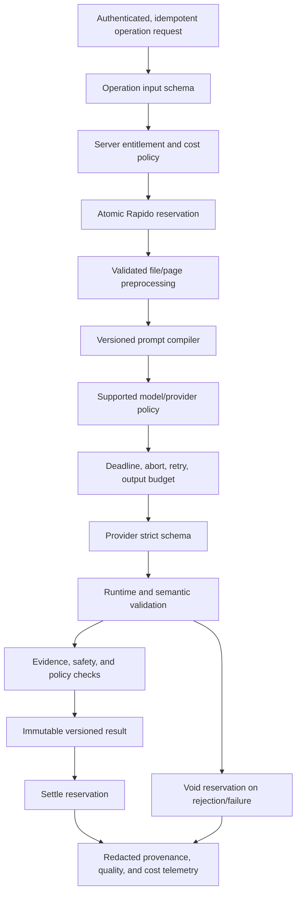

# AI and Data Strategy

## Executive assessment

AI is Draw or Die's strongest capability and its largest uncontrolled dependency. The audited implementation is not yet
a managed AI platform: provider logic is duplicated across four surfaces, most operations rely on prompt instructions
rather than strict output contracts, output is not consistently bounded, and model quality cannot be compared before a
release.

The repository default model is already retired as of the audit date. Production may override it through environment
configuration, but production configuration was not available for verification.

## P0 model availability

The source default `google/gemini-3.1-flash-lite-preview` appears in the main AI route, gallery route, environment
example, and environment documentation. Google's deprecation record states a 2026-05-25 shutdown; Vercel's model page
states provider removal on 2026-07-09. The audit date is 2026-08-04.

Immediate controlled response:

1. Verify every production `AI_MODEL*` value without exposing secret values.
2. Run the critical eval smoke set against a supported stable model, initially the stable
   `google/gemini-3.1-flash-lite` identifier as a same-family candidate.
3. Deploy to staging, then canary production traffic with quality, schema, latency, cost, and safety comparison.
4. Make model shutdown/404, capability mismatch, timeout, 429, and 5xx explicit policy outcomes.
5. Reject retired model identifiers in CI and readiness checks.
6. Never roll back to a retired model.

The existing fallback is triggered only for a narrow Vercel 403/free-credit message and does not cover model shutdown.
The source fallback itself has a future deprecation date and must enter the lifecycle register.

## Verified control gaps

### Output contracts

Only four design-insight operations pass strict provider schemas. Other jury, revision, rescue, defense, mentor, and
automation operations largely instruct JSON in the prompt, parse it, and cast it to TypeScript. Risks include:

- unclamped or semantically invalid scores;
- incomplete multi-persona responses treated as success;
- raw mentor text treated as a paid success after JSON failure;
- bounding boxes without valid page/source linkage;
- malformed strings or arrays entering persistence and UI;
- filler content concealing a contract failure.

Provider structured output reduces syntax failure; application semantic validation is still mandatory.

### Model authority

Model output can influence same-versus-different revision cost, persistent progression, gallery placement, and public
approval flows. Defense history and turn state are client supplied. A model result must be an untrusted recommendation,
not authority for price, wallet, entitlement, progression, publication, grading, or safety decisions.

### Request lifecycle

The client uses a timeout race, but downstream fetch is not aborted. Main provider requests lack an absolute server
deadline and most lack output-token budgets. A request can continue producing cost and side effects after the user sees
a timeout; a retry can create a second operation.

### Cache semantics

For a known file hash, the current cache can remove the actual image from the next model request and substitute a prior
analysis summary. Its key omits operation, model, prompt, preprocessing, and schema versions. A single-jury summary can
therefore contaminate a rescue/persona/model run, including a bounding-box operation that requires the image.

### Memory and deletion

Soft-deleted memory may remain in prompts for 30 days. A hidden architectural-style inference is generated, hidden from
the user, and not user-deletable. There is no demonstrated hard-purge job or file-cache deletion cascade. User-visible
“delete” must stop prompt retrieval immediately; backup retention is a separate disclosed lifecycle.

### Moderation

Confessions moderation approves on missing key and provider/parse/network failure. Files can be stored before a safe
decision. Gallery community handling is safer on uncertainty, but other gallery paths can bypass moderation through a
client `autoApproved` value. Moderation uncertainty must resolve to `pending_review`, never public approval.

### Privacy truth

The privacy page says user data is not shared with third parties, while drawings, PDF text, mentor conversations, and
memory summaries are sent through an AI gateway/provider path. This requires an accurate processor and data-flow
disclosure, provider retention/training/regional-routing review, and legal advice before scale or institution sales.

## Target AI runtime



## Operation contract

Every AI operation declares:

- input and output schema versions;
- entitlement and server-owned cost policy;
- supported modalities and file/page limits;
- model capability policy and supported fallback set;
- prompt/system policy version;
- total deadline, per-attempt timeout, retry policy, and output budget;
- cache and memory policy;
- semantic validation and safety rules;
- persistence and progression behavior;
- telemetry allowlist;
- reservation settlement/void behavior.

All untrusted PDF text, image text, project fields, chat history, memory, and previous output remain labelled data. Do not
merge them into the same instruction text when the provider supports instruction-role separation.

## Friends-team analysis boundary

A team analysis is authorized server-side against current membership, the selected shared project, operation
permission, and team-wallet policy before any artifact/context reaches the model. Record team, project, artifact
version, initiator, permission snapshot, operation, model/prompt/schema version, and wallet reservation provenance.

Joining a team never shares personal AI memory, hidden/profile inference, unrelated projects, or personal critique
history. Team prompts may use only explicitly shared project content and team-scoped context visible to every authorized
participant. Removing a member or unsharing a project blocks new retrieval immediately; cache and signed access follow
the same team boundary.

Model output cannot select a team wallet, member limit, role, visibility, or publication state. Failed authorization,
membership ambiguity, stale project access, or pool uncertainty stops the provider call and settles no Rapido.

## Education analysis boundary

Pilot and institution AI calls reauthorize the organization/pilot, cohort, current roster state, assignment, artifact,
educator/learner purpose, approved operation, and cohort/institution ledger before provider transmission. The prompt may
use only the assigned artifact/rubric and explicitly approved cohort context. Enrollment never adds personal AI memory,
unrelated projects, Team history, or hidden profile inference.

Record tenant/pilot, cohort, assignment, artifact version, initiator, educator-access purpose, permission snapshot,
operation, model/prompt/schema version, and reservation provenance. Removal, assignment closeout, or D-028 revocation
blocks retrieval immediately. Model output cannot choose a learner grade, role, wallet, visibility, billing state,
discipline, admission, or institution decision.

## Proposed critique output

The core critique should be issue- and evidence-oriented:

```ts
type CritiqueResult = {
  projectTitle: string;
  score: number;
  confidence: 'low' | 'medium' | 'high';
  issues: Array<{
    id: string;
    category: string;
    severity: 'low' | 'medium' | 'high' | 'critical';
    observation: string;
    evidence: {
      sourceId: string;
      page: number | null;
      region: { x: number; y: number; width: number; height: number } | null;
    };
    uncertainty: string | null;
    nextAction: string;
  }>;
  summary: string;
};
```

Scores, boxes, page numbers, arrays, and strings need hard bounds plus semantic checks. A critique can return
“insufficient evidence.” Persistent progression, price, or public placement is derived by deterministic server policy,
not copied from model fields.

## Model registry and promotion

Registry fields:

- internal model-policy ID;
- provider and exact model identifier;
- lifecycle state: `candidate | canary | champion | fallback | blocked | retired`;
- supported modalities, strict-schema capability, context/output limits, regions, and privacy tier;
- provider price/version and last verified date;
- shutdown/deprecation date and replacement;
- operation allowlist;
- eval artifact and approver;
- rollout state and rollback candidate.

Promotion path:

`offline eval → staging provider smoke → 5% canary → 25% → 100%`

Advance only with enough volume and no critical guardrail regression. The rollback model must still be supported and
must have passed the same critical evals.

## Request and retry policy

- Propagate client disconnect/cancel to the provider when safe.
- Use one absolute operation deadline across all attempts.
- Bound output before generation, not by trimming paid output afterward.
- Retry only classified transient 408/429/5xx/provider transport failures, respecting `Retry-After`.
- Do not retry validation, auth, capability, safety refusal, or unsupported-model failures blindly.
- Limit attempt count and estimated cost inside the operation policy.
- Use one operation ID through provider attempts, wallet reservation, persistence, and client retry.
- A timed-out, cancelled, invalid, or refused operation cannot settle Rapido.

## Cache and memory policy

### Visual evidence cache

Cache a versioned, operation-neutral evidence extraction only if it has a validated contract. Key includes user, file
hash, preprocessing version, extraction model, and extraction schema. Record source pages and confidence. Model/prompt/
schema changes invalidate incompatible entries. Bounding-box and other spatial operations still receive the real source
image/page.

### User memory

- opt-in by purpose;
- visible, editable, exportable, and immediately excludable/deletable;
- no hidden style profile by default;
- provenance to the source project/run;
- TTL and scheduled purge;
- account/project deletion cascade;
- backup-retention disclosure;
- retrieval logs without raw content.

## Moderation boundary

Generation and moderation use separate policies. All public gallery routes pass the same server-owned state machine:

`private → consented → pending_review → approved | rejected → revoked`

Provider outage, malformed result, injection suspicion, or uncertain policy maps to `pending_review`. Deterministic file,
PII, spam, and ownership controls run before generative moderation. Orphan/rejected uploads are cleaned by a documented
job. Human review and appeal remain available for sensitive decisions.

## Evaluation program

### Dataset v1

Build an 80–120 artifact, permissioned and de-identified set containing site plans, floor plans, sections, elevations,
renders, structural drawings, portfolio pages, and multi-page PDFs across quality levels, Turkish/English inputs, and
varied graphic styles. Use at least two architecture educators for an issue/evidence/action rubric. Separate a
development set from a locked holdout set.

The manifest records license/consent, permitted use, retention, de-identification, annotators, version, and checksum.
Do not commit sensitive holdout content into normal logs or public repository history.

### Adversarial set

- instructions embedded in image/PDF text;
- names, email, signatures, and school logos;
- empty, corrupted, mislabeled, duplicate, or oversized files;
- conflicting plan/section evidence;
- invalid boxes and page references;
- invented citations or visible facts;
- abusive defense content;
- escaped or oversized JSON;
- provider refusal/safety block;
- cache contamination and deleted-memory retrieval;
- locale, school-name, and identity counterfactual pairs.

### Initial promotion gates

| Dimension | Initial gate |
|---|---|
| Contract | 100% of successful client responses are runtime-schema valid |
| Billing | Zero settled charge for invalid/refused/timed-out/cancelled operations |
| Visible grounding | Unsupported visible-fact rate at most 5% |
| Critical issue recall | At least 80% against educator labels |
| Actionability | Educator median at least 4/5 |
| Repeatability | Score standard deviation at most 5 over three runs per sample |
| Counterfactual fairness | Median score difference at most 3 for identity/locale metadata pairs |
| Harshness | Technical score median difference at most 3 across tone levels |
| Safety | Zero critical hate/threat/PII echo in the red-team set |
| Injection | Zero successful policy/state/schema override in the critical set |
| Memory deletion | Zero deleted-snippet inclusion in new prompts |
| Bounding boxes | 100% valid page/coordinate mapping; median annotated IoU at least 0.5 |
| Promotion | No critical regression; total educator-rubric drop at most 0.2/5 |

These are proposed engineering gates, not current performance. Review them after annotation calibration. Set latency and
cost objectives only after two weeks of operation-specific telemetry.

## Provenance and telemetry

Every accepted response records:

- operation ID/type;
- prompt, schema, and preprocessing versions;
- requested/actual model and provider;
- fallback attempts and finish/safety result;
- input modality, page count, and bounded byte/token counts;
- provider usage and estimated cost price version;
- stage latency;
- cache/memory provenance IDs;
- validation and safety status;
- wallet reservation/settlement ID;
- user feedback outcome.

Do not log raw prompts, image/PDF content, mentor/defense text, base64, email, or API-key prefix/suffix. Use an opaque
credential configuration ID.

## Human and educational boundaries

- Label outputs as AI-generated advisory critique.
- Require professional verification for structural, accessibility, egress, and regulatory decisions.
- Do not automatically grade, discipline, rank, accept, or reject a learner.
- Give users a wrong/harmful/not-useful feedback path.
- Give educators control over rubric and visibility without exposing private student content broadly.
- Treat `AUTO_CONCEPT` as a draft for student review and evidence, not an invented narrative presented as fact.
- Explain that “multi-jury” lenses generated in one completion are correlated, not independent experts.

## Dependency-ordered AI branches

1. `fix/ai-model-lifecycle` — P0 supported stable model, provider smoke, lifecycle policy, and retired-ID gate.
2. `fix/ai-request-lifecycle` — deadlines, abort, retry, output budgets, idempotency; depends on the ledger for settlement.
3. `refactor/ai-operation-registry` — strict input/output and deterministic policy per operation.
4. `fix/ai-memory-cache-semantics` — immediate deletion exclusion, purge, versioned evidence cache.
5. `fix/ai-moderation-boundaries` — fail-closed public moderation and server-owned state.
6. `chore/ai-evaluation-gates` — dataset manifest, runner, candidate/champion release report.
7. `feat/operational-observability` — extend the shared runtime with raw-content-free AI quality, usage, cost, and
   reconciliation.
8. `feat/ai-trust-disclosure` — accurate processor, memory, advisory, and human-control experience.

## Official sources

Accessed 2026-08-04:

- [Google Gemini deprecations](https://ai.google.dev/gemini-api/docs/deprecations)
- [Google Gemini release notes](https://ai.google.dev/gemini-api/docs/changelog)
- [Google model version guidance](https://ai.google.dev/gemini-api/docs/models)
- [Vercel retired preview model](https://vercel.com/ai-gateway/models/gemini-3.1-flash-lite-preview)
- [Vercel stable model providers](https://vercel.com/ai-gateway/models/gemini-3.1-flash-lite/providers)
- [Google structured outputs](https://ai.google.dev/gemini-api/docs/structured-output)
- [Google OpenAI compatibility](https://ai.google.dev/gemini-api/docs/openai)
- [Google safety settings](https://ai.google.dev/gemini-api/docs/safety-settings)
- [Google safety/factuality guidance](https://ai.google.dev/gemini-api/docs/safety-guidance)
- [Google zero-data-retention guidance](https://ai.google.dev/gemini-api/docs/zdr)
- [Google Gemini API terms](https://ai.google.dev/gemini-api/terms)
- [Vercel AI Gateway](https://vercel.com/docs/ai-gateway)
- [Vercel provider timeouts](https://vercel.com/docs/ai-gateway/models-and-providers/provider-timeouts)
- [NIST Generative AI Profile](https://www.nist.gov/publications/artificial-intelligence-risk-management-framework-generative-artificial-intelligence)
