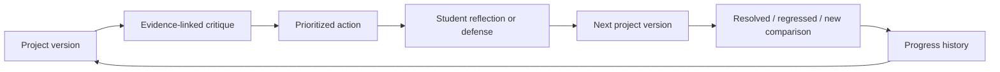

# Product Strategy

## Product thesis

Draw or Die should not compete as a broad “AI architecture platform.” Its strongest wedge is an architecture jury
rehearsal and revision coach for students working between human desk critiques.

The product promise:

> Upload your board. Rehearse the jury. Prove your revision.

The system should help a learner identify vulnerable decisions, select the next action, revise the same project, and
see whether the change resolved the problem. “Brutal jury” is a memorable campaign persona, not the educational value
proposition and not permission to humiliate users.

## Primary users and jobs

### Architecture student

When a jury is approaching and an instructor is unavailable, the student wants to find weak decisions, prioritize the
next revision, and rehearse a defense without pretending the AI is an authority.

### Portfolio candidate

When applying to school or work, the candidate wants to identify the pages and narratives that most weaken the whole
portfolio, revise them, and present a coherent artifact.

### Friends team

When preparing for a jury together, one student wants to invite up to five verified friends into a private workspace,
share selected projects, run team-visible analyses, and consume an agreed shared Rapido pool without exposing or
transferring anyone's personal balance.

### Studio educator

Between desk critiques, the educator wants a consistent feedback floor, privacy-thresholded cohort evidence, and a way
to identify where human attention is most needed. Individual project visibility is limited to approved assignments
under D-028, with notice and an access log. The product remains a supplement, never an autonomous grade or certification system.

## Defensible product layer

Personas, PDF vision, and mentor chat are reproducible features. A stronger moat is the accumulated, permissioned graph
of learning progress:

Over time this can include studio rubric context, instructor intervention signals, and portfolio outcomes. It must not
be built from private artifacts without explicit purpose, consent, retention limits, and user control.

## Current journey failures

| Journey | Verified failure | Required product behavior |
|---|---|---|
| First analysis | Blocking tutorial, dense form, hidden guest-auth failure | Progressive guidance, preserved input, visible recovery |
| Result privacy | Free results can be auto-approved for gallery despite privacy copy | Private by default; explicit, revocable publish consent |
| Guest conversion | Anonymous state appears registered and can reach checkout | Explicit account state and lossless conversion before payment |
| Revision | History reopen loses source context and `previousProject` | Persistent project lineage and resume-to-revision |
| Analysis wait | Generic spinner with no stage, expectation, cancel, or retry | Honest stage, timeout, abort, idempotent retry, `aria-live` |
| Result action | Interruptive upsell and several competing actions | Revision first; save/share/export secondary; contextual upgrade |
| Mentor | Locked and empty states can be dead ends | Explain value and provide signup, upgrade, and Studio paths |
| ArchBuilder | Marketing CTA reaches a presentation screen, not the working flow | One truthful entrypoint or a clearly labelled preview |
| Portfolio | Mouse-only editor and no complete publish contract | Mobile/keyboard support, autosave, recovery, explicit privacy |
| Community | Weak ownership, report, deletion, and appeal path | Durable ownership and complete safety lifecycle |

## Product principles

1. **Private by default.** Analysis and publishing are separate user decisions.
2. **Revision before consumption.** Optimize for improved work, not generated-output volume.
3. **Evidence over authority.** Cite visible evidence and confidence; invite verification and reflection.
4. **Human control.** Educators and users decide what to accept; the AI does not grade, certify, or approve safety.
5. **Recovery is a core feature.** Save user input, explain failures, and make retries idempotent.
6. **One primary action.** Each screen has one dominant next step consistent with the design system.
7. **Account state is explicit.** Visitor, guest, registered, and premium are different contracts.
8. **Accessibility is release quality.** Keyboard, touch, reduced motion, semantics, contrast, and error recovery are gates.
9. **Every paywall follows value.** Privacy, account recovery, deletion, and basic reliability are never monetized.
10. **Incubations do not blur the wedge.** New surfaces earn core navigation through measured product contribution.
11. **Team access is explicit.** Membership, project sharing, analysis authority, and shared spending are separate
    permissions; joining a team never exposes all personal projects or Rapido.
12. **Enrollment is not blanket access.** Joining a school cohort never exposes personal projects, history, AI memory,
    or Rapido; educator access is assignment-scoped, purpose-bound, visible, logged, and portable under D-028.

## Target core experience

### 1. Prepare

- Drag or choose drawing/PDF.
- Validate locally and on the server.
- Ask only the minimum context for the first useful critique.
- Put advanced program, site, rubric, and persona settings behind progressive disclosure.
- State privacy, expected cost, and advisory limitations before submission.

### 2. Analyze

- Show honest stages derived from server state, not a fabricated percentage.
- Preserve file and form state.
- Support cancel where safe and idempotent retry after failure.
- Explain provider delay, validation failure, insufficient balance, and entitlement failure differently.

### 3. Decide

- Return a small prioritized issue set first.
- Link each issue to visual/textual evidence and a confidence/uncertainty signal.
- Let the user accept, defer, challenge, or dismiss an issue.
- Offer defense and mentor as tools around the issue, not disconnected chat products.

### 4. Revise

- Preserve project ID, source version, issue IDs, rubric, and user decisions.
- Upload a new version without rebuilding project context.
- Compare resolved, partially resolved, regressed, and newly detected issues.

### 5. Prove and share

- Generate a private progress summary.
- Offer an explicitly redacted, revocable share artifact.
- Never publish the source drawing or critique by implication.

### 6. Collaborate privately

- Let one owner invite up to five verified teammates.
- Share only deliberately selected projects into the team workspace.
- Keep team analyses, actions, and revisions visible to authorized members with an audit trail.
- Charge the server-selected team pool only when membership, project access, limits, and balance are valid.
- Make removal, unshare, export, and team closure preserve personal ownership and customer value.

## Surface portfolio

| Classification | Surfaces | Decision |
|---|---|---|
| Core | Hero, Studio Desk, jury, result, revision, history, account, billing | Invest now |
| Core retention | Defense, AI Mentor | Integrate into issues and revision history |
| Planned collaboration | Private team workspace, shared analysis, shared Rapido | Invest after revision, ledger, storage, and privacy gates |
| Growth loop | Gallery, peer review | Invest only after consent, ownership, and moderation controls |
| Incubate | ArchBuilder, Portfolio | Feature-flag; separate success metric; do not dominate navigation |
| Hold/review | Confessions, leaderboard, charette | Do not scale until core contribution and safety cost are proven |
| Acquisition utility | References | Measure qualified Studio activation; review rights before indexing |

The anonymous Confessions surface has a different safety and moderation profile from the jury product. Engagement alone
is not evidence that it belongs in the same brand or operating model.

## Accessibility and design-system quality

The repository design source of truth specifies a 64-pixel fixed header, one red primary CTA, tightly scoped semantic
colors, visible disabled premium gates, restrained motion, and inline recoverable errors. The current product diverges in
core places: rogue semantic colors, glow outside the primary CTA, scale motion, missing focus handling, nested buttons,
unlabelled inputs, hover-only comparison, mouse-only portfolio editing, and no reduced-motion implementation.

Required release checks for the core flow:

- WCAG 2.2 AA target with documented exceptions;
- axe checks plus human keyboard and screen-reader smoke;
- focus trap, return, Escape, and logical heading order for dialogs;
- label/input relationships and inline error descriptions;
- touch alternatives for every hover and mouse-only action;
- `prefers-reduced-motion` behavior;
- route loading, error, and not-found recovery;
- visual regression against the design-system reference artifacts.

## Product discovery plan

Do not infer demand from code volume. Run discovery in parallel with P0 remediation:

| Group | Initial sample | Questions to answer |
|---|---:|---|
| Current/recent architecture students | 12–18 | Jury workflow, trust, useful evidence, privacy, willingness to revise/pay |
| Educators/studio coordinators | 8–12 | Feedback bottleneck, rubric, control, data policy, pilot budget and buyer |
| Portfolio applicants/recent graduates | 6–10 | Outcome, deadline, human alternatives, repeat need, price sensitivity |
| Existing friend/study teams | 6–8 teams | Invite behavior, shared-project boundary, pool control, support, willingness to pay |
| Churned/failed users | As available | Where value or trust broke; recovery expectations |

Use artifact walkthroughs, not feature wish lists. Ask participants to show their current critique and revision process.
Do not claim learning impact from satisfaction scores.

## Product success definition

The product succeeds when a verified user completes a critique, selects an action, and returns with a revision of the
same project. The primary metric and guardrails are defined in
[Metrics and experiments](./METRICS-EXPERIMENTATION.md).
