# Quality, Reliability, and Delivery

## Release-readiness verdict

Red. The live site responds, but the audited `main` source is not reproducibly buildable and the delivery controls do
not prove that a tested source artifact is the artifact running in production.

## Baseline on 2026-08-04

| Signal | Result |
|---|---|
| Lint | 1 parser error and 125 warnings |
| Typecheck | 3 conflict-marker errors |
| Jest coverage run | 22 suites passed, 15 failed; partial statement coverage 8.96% |
| Individual tests | 149 passed, 1 behavioral assertion failed |
| Production dependency audit | 9 high and 6 moderate findings |
| API surface | 35 route files; 2 direct route test files |
| E2E | One spec with homepage and shallow health checks |
| CodeQL | Current run failed during application build; analysis skipped |
| Release workflow | Latest 11 observed runs failed |

Fourteen suites fail to load because React and React DOM resolve to different exact versions. The JSON code-fence
parsing behavior also fails independently. Current coverage excludes important route and store code, and no threshold
prevents near-zero critical-path coverage.

## Delivery failure modes

- Release-gate path filters omit normal application changes.
- Pull-request path filters omit some test, locale, and environment-contract changes.
- One approving review is required, but successful status checks are not required by branch protection.
- Force-push and deletion are allowed; admin enforcement is disabled.
- The staging job builds but does not prove a real staging deployment.
- Playwright receives `TEST_ENV` while configuration reads `STAGING_URL`, so the intended target is not guaranteed.
- The Appwrite staging validation is configured with a production site identifier.
- CI/gates use Node 20, local audit used Node 22, and production deployment uses Node 24.
- Production deployment activates a new source archive before a pre-activation smoke test.
- Health and payment scripts can report success without proving the intended live dependency behavior.
- Project guidance names Vercel while release automation deploys Appwrite Sites; operational authority is ambiguous.

## Target release path

```mermaid
flowchart LR
  A["Short-lived branch from dev-main"] --> B["Pull request"]
  B --> C["Static, unit, integration, security gates"]
  C --> D["Build once + provenance"]
  D --> E["Deploy exact artifact to dev/staging"]
  E --> F["Synthetic + E2E + migration compatibility"]
  F --> G["Approved promotion from main"]
  G --> H["Progressive production activation"]
  H --> I["Post-deploy verification + automatic rollback"]
```

Do not rebuild between staging and production. Record commit SHA, lockfile hash, build runtime, artifact digest,
migration compatibility, and deployment ID.

## Branch and environment protection

### `dev-main`

- reconcile its divergent history with the verified green baseline through normal reviewed history;
- block force-push and deletion;
- require stable named checks, conversation resolution, and up-to-date branch;
- require PRs for all production-code changes;
- enforce checks for administrators;
- use the development environment and never production credentials.

### `main`

- accept only reviewed release/hotfix PRs;
- block force-push, deletion, and direct pushes;
- require all delivery, security, migration, and artifact checks;
- require at least one independent approval for money, identity, privacy, schema, or deployment changes;
- require protected production environment approval and a `refs/heads/main` source assertion;
- record emergency override identity and post-incident review.

For a solo-maintainer period, never replace independent review with a fake approval. Required automated checks remain
mandatory; high-risk branches can use an external reviewer or scheduled release window until staffing exists.

## Hermetic runtime policy

Choose one supported Node LTS after dependency compatibility testing, likely aligning on the production runtime rather
than retaining three versions. Pin it in `package.json` engines and a repository version file, then use it in every
workflow and deploy environment. Pin compatible React/React DOM exact versions and verify two clean builds in isolated
containers produce equivalent artifacts.

Dependency policy:

- production critical/high findings fail the gate unless a time-bounded exception documents reachability and owner;
- moderate findings receive an SLA based on reachability;
- direct framework/security updates use compatibility branches, not blind major upgrades;
- generate an SBOM and retain the dependency audit with the release;
- pin GitHub Actions to reviewed commit SHAs;
- remove the `|| true`/non-blocking audit behavior for policy-level findings.

## Test portfolio

### Static gates

- conflict-marker scan;
- formatting/lint with zero errors and a warning-burn-down policy;
- strict typecheck;
- forbidden `any`, console, secret, hardcoded price/cost, and client-server import checks;
- schema and migration validation;
- dependency and secret scans.

### Unit and contract tests

- pricing, wallet state, entitlement policy, operation registry, prompt builders, output schemas;
- profile DTO allowlist and account-state transitions;
- Stripe event state machine and expected product/amount/currency validation;
- team capacity, invite, role, project-share, owner-transfer, and wallet-authority policies;
- file signature/limit validators using production functions;
- analytics event schema and PII rejection.

### Integration tests

Call real route handlers or a deployed test service. Minimum adversarial matrix:

- visitor/guest/unverified/verified/premium authorization;
- two-user ownership isolation;
- guest conversion without data/value loss or duplication;
- no gallery write before consent and revocation afterward;
- AI reserve/settle/void under concurrency and failure;
- duplicate, delayed, out-of-order, refunded, and failed Stripe events;
- storage read/write/delete across public/private boundaries;
- deleted memory excluded from every subsequent prompt;
- promotion/referral reward idempotency and quota;
- typed growth event persistence and purchase reconciliation;
- two-team invite/share/read/write/export isolation and removed-member/signed-access revocation;
- owner transfer/deletion without orphan workspace, subscription, project, or audit state;
- concurrent Team Rapido reserve/settle/void, wrong-wallet rejection, funding replay, expiry, and closure;
- two isolated education pilots with cross-pilot API/storage/export/analytics denial and cohort-ledger reconciliation;
- institution owner/admin/billing/educator/learner/support role separation and organization/cohort isolation;
- institution funding renewal/refund/replay, privacy-threshold reporting, export/delete, restore, and offboarding.

### E2E

Critical browser journeys:

1. guest upload → critique → result → account conversion → same project/value;
2. registered upload/PDF → AI success/failure/retry → revision comparison;
3. premium upgrade → signed webhook → entitlement → portal/cancel/period end;
4. Rapido purchase → balance projection → operation → history;
5. private-by-default result → explicit publish → manage/revoke;
6. keyboard/touch/reduced-motion core flow;
7. staging release SHA and dependency readiness;
8. team create → invite → accept → share → analyze → remove/unshare → export;
9. Team purchase/renewal → pooled allowance → concurrent spend → cancel/refund/owner transfer;
10. pilot provision → roster → cohort allowance → assignment analysis → removal → closeout/export;
11. institution create → roles → cohort → billing → reporting → isolated restore/offboarding.

Use mocks for deterministic failure and signed Stripe fixtures; keep a small real-provider canary separate from normal
PR tests. Never place live billing credentials in browser tests.

### Coverage policy

Coverage is a risk signal, not the goal. First include `app/api/**`, stores, and domain services. Establish the audited
baseline after the suite is green, then ratchet upward so coverage cannot fall. Set higher branch/condition requirements
for identity, wallet, Stripe, publishing, and permission policies. A copied helper does not count as production coverage.

## Staging and promotion

Required staging properties:

- isolated Appwrite project/site/storage and Stripe test mode;
- same schema migration path as production;
- correct `STAGING_URL` passed to deployed E2E;
- non-production analytics and `noindex,nofollow`;
- seeded synthetic accounts/data with teardown;
- safe provider quota and kill switches;
- artifact digest and release SHA visible;
- promotion of the exact tested artifact.

Production activation should support a pre-activation health check, progressive traffic or immediate kill switch for
risky operations, and rollback to the previous deployment ID. Run a rollback drill before calling the path ready.

## Health, telemetry, and SLOs

Split health endpoints:

- liveness: process can respond;
- readiness: required configuration and bounded dependency checks;
- diagnostic: authenticated detail for operators;
- release: SHA, build time, schema compatibility, model registry version, and deployment ID.

Instrument all routes with correlation ID, structured redacted log, latency, result class, and dependency span. Add
domain metrics for wallet drift, duplicate charge, Stripe queue age, entitlement mismatch, unauthorized publish, AI
model/fallback/cost/quality, storage failure, event delivery, and conversion reconciliation.

Proposed initial service objectives, to validate against real baselines:

| Service | Initial target | Critical correctness target |
|---|---:|---|
| Core authenticated API | 99.9% monthly availability | Cross-account access: 0 |
| Checkout creation | 99.9% | Wrong tier/amount/currency: 0 |
| Stripe event processing | 99.95% | Duplicate or lost value: 0 |
| AI completed analysis | 99.0% excluding user validation | Settled charge without accepted output: 0 |
| Public publishing | 99.9% | Publish without explicit consent: 0 |
| Friends Team | 99.9% | Cross-team/removed-member access or wrong-wallet charge: 0 |
| Education pilot | 99.9% | Cross-pilot access, wrong cohort wallet, or uncontrolled overage: 0 |
| Institution | 99.9% | Cross-organization/role escalation, duplicate funding, or restore contamination: 0 |

If 50% of a monthly error budget is consumed by mid-period, pause feature releases in that service until recovery work
is complete. Correctness invariants have zero budget.

## Alerting and incident response

Alerts need an owner, severity, runbook, and actionable threshold. Initial pages:

- release health or synthetic core journey failure;
- non-zero money/entitlement reconciliation drift;
- Stripe failed-event age over target;
- unauthorized or unowned public content signal;
- cross-tenant permission test failure;
- cross-team/removed-member access, ownerless workspace, or Team wallet reconciliation drift;
- cross-pilot access, cohort-wallet drift, uncontrolled overage, or failed pilot restore;
- cross-organization/role escalation, duplicate institution funding, or tenant restore/offboarding failure;
- AI failure/cost/fallback spike;
- production error/latency budget burn;
- backup or restore verification failure.

Define SEV1–SEV4, command/communications roles, customer remediation, evidence preservation, and blameless postmortem
follow-up. Avoid alerting on every error; page on customer-impacting conditions.

## Backup and disaster recovery

Inventory Appwrite database, storage, auth linkage, Stripe-reconstructable state, configuration, secrets, and deployment
artifacts. Define proposed RPO/RTO by class, then validate platform capability:

| Data class | Proposed RPO | Proposed RTO |
|---|---:|---:|
| Money and entitlement ledger | Effectively zero through source-event replay | 60 minutes |
| Identity/profile linkage | 1 hour | 4 hours |
| Private project/history | 24 hours or better | 8 hours |
| Public gallery/moderation | 24 hours | 8 hours |
| Analytics | 24 hours | 48 hours |

Run restore drills at least twice yearly and after material storage/schema changes. A backup is not evidence until a
restore into an isolated environment passes integrity and tenant-isolation checks.

## Release definition of done

- exact artifact passed every required gate;
- migration forward/compatibility/rollback evidence exists;
- monitoring queries, reconciliation reports, and alert changes are live before exposure;
- kill switch and rollback are tested;
- security/privacy/product contracts and docs are updated;
- post-deploy synthetic checks pass against release SHA;
- money, entitlement, and event reconciliation remain clean;
- branch plan acceptance evidence is linked from the PR.
