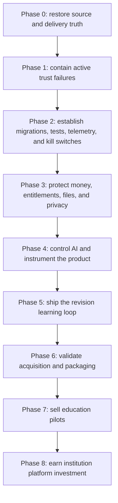

# Integrated Roadmap

## How to use this roadmap

This is a dependency-ordered program, not a promise that every branch should ship. The normative `Depends on` DAG in
each branch plan controls when risk-reducing implementation may start; unrelated work in an earlier phase cannot block
a remediation whose own dependencies are green. Phase exit gates instead control capability re-enable, paid growth,
new exposure/data collection, and formal program progression.

Priority does not override safe dependencies. A P0 that cannot be fully remediated in Phase 0/1 must be contained within
the approved incident window: pause the affected public write, reward, education verification, Checkout, paid AI, or
direct file mutation;
preserve inbound Stripe/source events and customer data; and keep the capability closed until its branch exit evidence
is complete. Immediately verify live Appwrite permissions and AI model configuration through read-only operator checks.
Immediate operator holds follow the [P0 containment runbook](./P0-CONTAINMENT-RUNBOOK.md). Any urgent additive state or
restrictive permission change must follow the
[emergency change protocol](./EMERGENCY-CHANGE-PROTOCOL.md); it may not recreate request-time schema bootstrap.

## Phase 0 — Restore truth and control (0–72 hours)

Branches:

1. `fix/release-build-blockers`
2. `fix/repository-release-gates`
3. `fix/staging-artifact-promotion`
4. `fix/p0-capability-containment`
5. `chore/enterprise-audit-validation` after the audit package exists on `dev-main`

Outcomes:

- resolve the conflict without silently choosing behavior;
- align exact React/React DOM and supported Node versions;
- make clean install, lint, typecheck, tests, build, and smoke reproducible;
- reconcile and protect the existing `dev-main`, harden `main`, and make failed checks impossible to bypass accidentally;
- make documentation-only planning changes pass a required link/metadata/decision/DAG/traceability check;
- deploy the same immutable artifact to real staging and production;
- prove that the running artifact reports the commit and digest that produced it.
- hold unsafe public-write, reward, education-verification, storage-mutation, paid-AI, and Stripe-processing paths
  safely while permanent remediations are incomplete;
- disable all new Checkout whenever Stripe processing is paused, while preserving cancellation, refund, portal, and
  support access.

Exit gate: deliberately failing application and enterprise-audit documentation PRs cannot merge; a verified hotfix can
roll forward and back using documented commands and the same built artifact. Live evidence also shows zero
non-consensual public write/delivery, zero
client-visible or legacy-verifiable OTP, zero unverified reward, zero broad direct storage mutation, zero paid operation
on an unsafe model/wallet path, zero new Checkout while Stripe effects are paused, zero payment without reconciled
entitlement, and durable signed Stripe-event intake.

## Phase 1 — Contain active trust failures (days 2–10)

Branches:

1. `fix/explicit-gallery-consent`
2. `fix/historical-gallery-remediation` after D-004 approval
3. `fix/security-edu-otp-secrecy`
4. `fix/guest-account-conversion`
5. `fix/security-verified-identity-rewards`
6. `fix/ai-model-lifecycle`
7. `fix/search-identity` in parallel

Outcomes:

- no private analysis reaches public or moderation storage without explicit, recorded consent;
- mailbox verification secrets never cross a client-readable boundary;
- anonymous work can be converted to a verified account without losing data or presenting false account state;
- referral, registration, education, and promotional rewards require server-owned eligibility;
- every production AI surface uses a supported stable model with a verified canary and supported rollback.
- legacy search identity is corrected and non-production indexing/analytics contamination is blocked.

Exit gate: adversarial integration tests demonstrate that an anonymous or unverified actor cannot publish, verify,
purchase restricted products, or receive restricted value outside the documented contract.

## Phase 2 — Establish safe operating foundations (weeks 1–3)

Branches:

1. `refactor/versioned-appwrite-migrations`
2. `feat/server-enforced-kill-switches`
3. `chore/critical-contract-harness`
4. `chore/security-runtime-dependencies`
5. `fix/http-security-boundaries`
6. `feat/operational-observability`
7. `docs/incident-dr-release-runbooks`

Outcomes:

- versioned, reversible schema changes leave the customer request path;
- AI spend, reward grant, checkout, and public-write paths have audited server kill switches;
- production route/helpers—not copied examples—are covered by fault, replay, and concurrency tests;
- one supported runtime and dependency exception policy is enforceable;
- browser/origin controls are tested;
- release identity, correlation IDs, redacted logs, audit events, and minimum reconciliation/drift alerts exist;
- incident, rollback, replay, compensation, backup, and restore procedures are exercised.

Exit gate: a forced failure is detected, the affected capability is disabled, the exact release is identified, and a
rollback/restore drill completes with an auditable incident record. This telemetry must exist before financial rollout.

## Phase 3 — Protect money, entitlements, files, and privacy (weeks 2–6)

Branches:

1. `fix/atomic-rapido-ledger`
2. `fix/stripe-webhook-idempotency`
3. `fix/stripe-entitlement-reconciliation`
4. `fix/security-storage-tenant-isolation`
5. `fix/privacy-data-lifecycle`

Outcomes:

- purchased, allowance, earned, promotional, reserved, settled, and voided value are distinguishable;
- Stripe delivery uses `received → processing → succeeded | failed` and can be replayed safely;
- renewals, cancellations, refunds, disputes, expiration, promotions, and customer reuse reconcile to the ledger;
- public and private files have separate tenant-safe permission models;
- retention, export, deletion, memory retrieval, and analytics consent match product claims.

Exit gate: concurrency, duplicate delivery, partial failure, refund, cancellation, renewal, expiration, and replay tests
produce zero unexplained money, entitlement, or file-ownership drift.

## Phase 4 — Control AI and instrument the product (weeks 4–9)

Branches:

1. `feat/product-funnel-instrumentation`
2. `fix/ai-request-lifecycle`
3. `refactor/ai-operation-registry`
4. `chore/ai-evaluation-gates`
5. `fix/ai-memory-cache-semantics`
6. `fix/ai-moderation-boundaries`
7. `feat/ai-trust-disclosure`

Outcomes:

- consent-aware typed events persist with guest-to-account identity stitching and purchase reconciliation;
- AI requests have deadlines, abort, bounded retries/output, idempotency, and ledger settlement semantics;
- operation-specific input, entitlement, cost, model, prompt, schema, persistence, and telemetry contracts exist;
- model/prompt/schema promotion requires reproducible eval evidence;
- deleted memory is excluded immediately and cache provenance cannot contaminate operations;
- public moderation fails to pending review, never approval.
- processor, memory, advisory, professional-limit, and public-use disclosures match enforced behavior before scale.

Exit gate: all successful AI responses pass runtime/semantic schemas; invalid/cancelled/timed-out work settles no
Rapido; the event funnel reconciles; candidate model/prompt changes can be accepted or rejected from an eval artifact;
deleted memory is absent from every new prompt; incompatible cache reuse is zero; uncertain public moderation remains
pending; and processor, memory, advisory, and professional-limit disclosures match verified behavior.

## Phase 5 — Build the revision product (weeks 7–14)

Branches:

1. `fix/revision-continuity`
2. `refactor/typed-analysis-state-machine`
3. `fix/core-flow-accessibility`
4. `feat/revision-learning-loop`
5. `refactor/app-router-boundaries` (optional, non-blocking modernization)

Outcomes:

- explicit state transitions and recovery semantics;
- history reopens the source/reference and resumes the same project without double charge;
- the core upload/auth/result/revision flow meets the accessibility gate;
- critique issues become selected actions and resolved/regressed/new revision evidence;
- route boundaries improve deep linking, recovery, metadata, and bundle isolation one slice at a time.

Exit gate: the revision loop improves Weekly Jury-Ready Iterations without crossing AI quality, privacy, accessibility,
refund, support, or contribution-cost guardrails.

## Phase 6 — Validate acquisition and packaging (months 3–6)

Branches:

1. `fix/acquisition-foundation`
2. `feat/premium-packaging`
3. `feat/portfolio-season`

Outcomes:

- route-specific public metadata, social assets, truthful CTAs, locale surfaces, and performance budget;
- one explicit contract for free, premium allowance, and purchased Rapido;
- contextual Jury Week/Revision/Portfolio outcome packages tested with contribution margin.

Exit gate: at least one packaging/acquisition hypothesis improves paid conversion or contribution margin without a
material revision-retention, trust, refund, or safety regression. Stop losing variants and record the decision.

## Phase 6T — Optional Friends Team track (months 3–7)

Branches:

1. `feat/private-team-workspace`
2. `feat/shared-team-rapido-pool`
3. `feat/team-packaging`

This track does not block individual Premium, Portfolio Season, or education discovery/pilot work. It may start only
after its own privacy, storage, revision, trust, ledger, and release dependencies are green.

Outcomes:

- private collaboration for one owner plus up to five invited verified members;
- explicit project sharing, team analysis/action/revision history, and immediate access revocation;
- a separately accounted shared Rapido pool with owner limits and no implicit personal-wallet transfer/fallback;
- evidence-priced Team packaging that stays separate from individual Premium and school contracts.

Exit gate: zero cross-team or removed-member access, wrong-wallet charge, negative/duplicate team spend, unexplained
pool drift, invite replay, ownerless workspace, or residual-value drift; plus positive paid-canary contribution evidence
and approved D-023–D-025 plus D-029.

## Phase 7 — Sell education pilots (months 4–9)

Short-lived protocol and evidence branches:

1. `docs/education-market-discovery` (protocol may begin earlier; no learner data or enrollment)
2. `docs/education-discovery-evidence` (opened only after approved interviews/proposals close)
3. `docs/education-studio-pilot` (contract, security boundary, runbook, and measurement protocol)
4. `feat/education-pilot-cohort-controls` (isolated boundary, roster authority, cohort ledger, and runbook)
5. `docs/education-pilot-evidence` (opened only after two paid pilot operations close)

Research and pilot operations are tracked in their approved operational systems, not a months-long Git branch. Each docs
branch closes after its protocol or frozen/redacted evidence package is reviewed.

Pilot before platform:

- one studio or cohort;
- 15–60 learners as the initial validation envelope;
- dedicated single-cohort data/storage isolation, roster access, audit, export/delete, and restore proof;
- clear educator boundary, data processing terms, deletion path, and support owner;
- baseline and endline measures for revision completion, reflection quality, educator time saved, and student usefulness;
- paid, time-bounded, concierge-supported contract;
- school-specific cohort/service pricing and included Rapido contract, separate from Friends Team;
- one separately provisioned environment/namespace and cohort-owned ledger per pilot until reusable institution tenancy
  is earned;
- assignment-scoped educator access, learner ownership/portability, and immutable access records under D-028.

Exit gate: `docs/education-pilot-evidence` records two separately isolated and reconciled paid pilots, no unresolved P1
trust incident or cohort-ledger drift, positive contract economics, and at least one paid renewal/expansion with an
approved D-027 `invest` decision.

## Phase 8 — Earn the institution platform (months 7–12+)

Branches, each with one rollback boundary:

1. `feat/institution-foundation`
2. `feat/institution-cohort-roster`
3. `feat/institution-billing-rapido`
4. `feat/institution-educator-reporting`
5. `feat/institution-recovery-offboarding`

Only after the Phase 7 gate, first add organization tenancy, separate owner/admin/billing/educator/learner/time-bounded
support roles, and audit. Add cohort/roster workflows, institution billing/Rapido, educator reporting, and recovery in
separate dependent branches. Institution reporting is limited to aggregate summaries and D-028-authorized assignment
access that answer validated educator decisions; it must not expose internal revenue/AI cost/conversion, learner
ranking, surveillance, or engagement vanity metrics.

Exit gate: D-027–D-028 and D-030–D-032 are approved; tenant/role/cohort/billing isolation, exact-once funding,
privacy-threshold reporting, export/delete, and full organization restore/offboarding tests pass; signed design-partner
acceptance and positive renewal economics are demonstrated.

## Portfolio capacity rule

The `docs/education-market-discovery` protocol and approved budget-holder discovery operations may run from Phase 0 in
parallel because they change no product, process no learner artifact, and start no pilot. Paid enrollment remains gated
by the discovery-evidence decision and `feat/education-pilot-cohort-controls` technical/privacy/security/ledger evidence.

Until Phase 4 is complete, run at most:

- one P0/P1 domain branch that changes money, identity, or data;
- one independent test/observability branch;
- one discovery-only product or commercial workstream.

This limits merge conflicts and makes fault attribution possible. Product experiments may be designed in parallel but
must not increase traffic or financial exposure before their dependency gates pass.

For Phase 6T, the private workspace may be developed independently after its gates. Shared-pool and Team-sale branches
must run sequentially and must not overlap another branch mutating Stripe, entitlements, or ledger authority. Individual
Premium remains independent and is never blocked by unfinished Team work.
