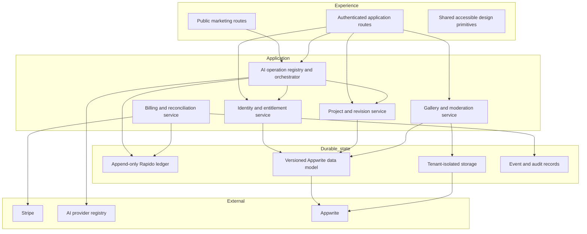

# Technology Architecture

## Architecture objective

Make identity, money, files, AI operations, and public publishing independently testable and observable. The target is
not a rewrite. It is a sequence of reversible boundaries around the highest-risk behavior.

## Current topology

The audited application combines:

- Next.js App Router pages and route handlers;
- a client-heavy root experience driven by Zustand step strings;
- Appwrite authentication, database, and storage;
- Stripe Checkout, subscriptions, and webhook processing;
- OpenAI-compatible Gemini requests;
- PDF text extraction and multimodal analysis;
- public gallery, peer review, portfolio, references, and anonymous community surfaces.

Useful central controls exist, including `lib/pricing.ts`, Appwrite server helpers, structured AI schemas, and a design
system. The main problem is responsibility concentration: the core AI route mixes authentication, entitlement, wallet,
prompts, model routing, parsing, progression, persistence, and response mapping in approximately 3,922 lines.

## Target domain boundaries



The diagram describes logical ownership. It does not require microservices. Keep these boundaries as modules inside the
Next.js deployment until traffic, team ownership, or isolation requirements prove a need to separate them.

## P0 architecture repairs

### Reproducible source

The core route's merge conflict must be resolved by reconstructing intended behavior from both merge parents, tests,
and documented contract. Deleting marker lines without deciding behavior is not acceptance. Pin compatible React and
React DOM versions and one supported Node runtime across local, CI, staging, and production.

### Durable delivery lane

Reconcile the existing `dev-main` history only after the verified recovery baseline exists; its snapshot tree matched
`main`, but the histories diverged. Protect `dev-main` and `main`; build once, deploy to real staging, test the deployed
URL, and promote the same artifact to production. Expose release SHA and build time from readiness metadata.

## Versioned Appwrite migrations

Remove admin DDL/resource creation from customer request paths. Introduce:

- ordered, immutable migration files;
- migration ID, checksum, started/completed time, runner version, and result ledger;
- dry-run and preflight checks;
- expand → migrate/backfill → verify → contract workflow;
- resumable backfills with checkpoints and rate limits;
- compatibility window for old and new application versions;
- documented rollback or forward-fix path;
- pre-deployment schema compatibility gate.

Never combine a destructive contract migration with the first application version that stops reading the old shape.
Dropping data or permissions requires explicit owner approval under the repository rules.

## AI operation registry

Each operation should be declarative and independently testable:

```ts
type OperationContract<Input, Output> = {
  id: OperationType;
  inputSchema: Schema<Input>;
  outputSchema: Schema<Output>;
  entitlement: EntitlementPolicy;
  costPolicy: CostPolicy;
  modelPolicy: ModelPolicy;
  timeoutMs: number;
  outputBudget: number;
  buildPrompt: (input: Input, context: OperationContext) => Prompt;
  persist: (output: Output, context: OperationContext) => Promise<void>;
};
```

The exact implementation can use existing dependencies. Required invariants:

- authenticate and authorize before expensive parsing/provider work;
- derive cost only from server-owned policy;
- reserve wallet value atomically and settle/void by idempotency key;
- choose models from a versioned registry, not scattered fallback strings;
- pass an abort signal and absolute deadline;
- validate output against the operation's production schema;
- separate user-provided context from system/developer instructions;
- record quality, cost, latency, and failure without storing raw private content in telemetry;
- persist and update progression only after accepted output.

Do not extract all operations in one “big bang” branch. Establish the registry seam, migrate one low-risk operation,
then move operations with characterization tests.

## Wallet and billing architecture

### Ledger

Use an append-only economic journal with immutable entries and a derived balance projection. A reservation lease may
have mutable operational state in a separate store, but it cannot be the economic record. Every transition appends a
new journal entry; settlement, void, expiry, refund, and correction never update an earlier entry. Conceptual fields:

- entry ID and idempotency key;
- user/account and wallet type;
- source type and source ID;
- signed Rapido amount;
- event type such as `reserved | settled | voided | granted | expired | refunded | adjusted`;
- related AI operation, Stripe event/session/invoice, referral, promotion, or admin adjustment;
- created/effective time and actor;
- metadata version.

Balance projection and reservation-lease updates must be atomic with journal append. Prefer a single Appwrite Function
or transactional store capability with a compare-and-swap/version condition if the database cannot provide
multi-record transactions. Prove concurrency behavior with load and fault-injection tests before migration.

### Reconciliation

Stripe events and wallet entries form separate durable ledgers connected by source IDs. Daily reconciliation should
identify missing, duplicate, amount/currency mismatched, failed, or orphaned effects without silently “repairing” them.
Human-approved adjustment entries preserve history.

## Identity and entitlement model

Represent account status explicitly:

```text
visitor → guest → registered_unverified → registered_verified → premium
```

Premium is an entitlement derived from subscription state, not a permanent boolean. Education price eligibility and
reward eligibility are different policies. Public profile DTOs must be allowlists and never serialize verification
secrets, internal moderation state, Stripe identifiers, or server-only controls.

## Friends-team workspace and shared Rapido

Model a friends team as a bounded collaboration account, not an institution tenant and not a collection of client-side
flags. Initial entities:

- `team` — owner, capacity, status, policy/version, created/closed state;
- `team_membership` — verified user, role, state, invited/joined/removed time, membership version;
- `team_invite` — hashed token, intended identity, expiry, one-time consume, revocation;
- `team_project` — explicit project share, source owner, team permissions, share/revoke state;
- `team_audit_event` — actor, team/project, permission decision, mutation, operation, and outcome;
- `team_wallet_account` — separate ledger account/projection linked to approved funding and team operations.

V1 assumes one owner plus no more than five invited verified members. Every team read, mutation, analysis, and wallet
reservation rechecks current membership, project permission, operation authority, and team status on the server. An
operation records the membership/policy snapshot used for its decision so removal and in-flight behavior reconcile.

Personal and team wallets never merge. Funding, reserve, settle, void, refund, expiry, and adjustment use the immutable
ledger with team/source/member/project provenance. Team-pool failure cannot silently fall back to personal Rapido.

School cohorts remain a separate contract and data boundary. Do not “upgrade” a friends team into an institution tenant
without the pilot evidence, organization schema, role model, migration, consent, billing, and restore gates.

## Education pilot and institution boundaries

Each paid pilot uses a separate environment or hard namespace until reusable tenancy is earned. Its minimum entities are:

- `pilot_cohort` — contract reference, school, budget holder, dates, cap, policy version, closeout state;
- `pilot_membership` — allowlisted learner/educator, role, state, notice/authority, join/remove time;
- `pilot_ledger_account` — contract-backed institutional allowance, reservation/settlement projection, expiry;
- `pilot_access_event` — actor, cohort, assignment/artifact, purpose, permission snapshot, outcome;
- `pilot_environment_record` — namespace/storage/key/backup/restore identifiers without secrets.

No pilot account, value, artifact, or role is reused across schools or Friends Team. The second paid pilot receives a
separate boundary and must pass cross-pilot tests before enrollment.

After D-027, the institution platform grows through separate modules: organization tenancy/RBAC; cohort/roster;
institution billing/Rapido; privacy-safe educator reporting; and recovery/offboarding. Shared identifiers never replace
server authorization. Billing admin, educator, learner, organization admin/owner, and time-bounded support are distinct
authorities. D-028 keeps personal artifacts/memory outside institution scope unless explicitly assigned.

## Project and revision model

Create durable lineage rather than treating analyses as unrelated results:

- `project` — owner, title/context, privacy, created state;
- `artifact_version` — immutable file reference, checksum, metadata, retention;
- `critique_run` — operation/model/prompt schema version, status, cost, artifact version;
- `critique_issue` — stable issue identity, evidence, priority, confidence;
- `user_issue_decision` — accept/defer/challenge/dismiss and optional reflection;
- `revision_comparison` — base/target versions and resolved/regressed/new status.

The UI can evolve before all records exist, but each schema addition must follow the migration and privacy controls.

## App Router boundaries

Move away from a single client-side pseudo-router incrementally:

- keep public pages server-rendered and cacheable where possible;
- use real routes for durable destinations and browser back/forward behavior;
- add route `loading`, `error`, and `not-found` boundaries;
- keep authentication/session reads in the narrowest dynamic layout;
- lazy-load expensive workspace surfaces;
- make metadata and locale route-specific;
- use client components only for interaction that requires browser state.

Do not rewrite working feature components during the first route extraction. Add a compatibility adapter around the
existing store, migrate one route, verify deep-link and recovery behavior, then repeat.

## Typed state transitions

Replace broad string-plus-optional-field combinations with a discriminated state model. The state should make it
impossible to render a result without its project/run, revise without a base artifact, or show premium success before
server confirmation. Transitions must distinguish cancel, validation failure, provider timeout, insufficient value,
authentication expiry, retryable failure, and terminal failure.

## API contract standard

Adopt a versioned response envelope with:

- machine-readable error code;
- localized client message key, not hardcoded server UI copy;
- request/correlation ID;
- retryability and optional safe retry delay;
- validated result payload;
- server-confirmed wallet/entitlement projection when relevant.

Centralize authentication, origin checks, rate limiting, JSON parsing, content-length limits, request IDs, and error
mapping as composable route utilities. Avoid a framework inside the framework; the goal is consistent controls.

## Dependency and module policy

- Mark server-only modules so secret-bearing imports cannot enter client bundles.
- Replace dynamic and relative imports where repository conventions forbid them.
- Remove dependencies only after static search, bundle analysis, and runtime verification prove they are unused.
- Record major library upgrades as separate compatibility branches.
- Treat `next.config.ts` lint bypass as temporary debt; release gates must not depend on build ignoring lint.
- Keep public functions explicit and unknown external payloads narrowed through production schemas.

## Architectural acceptance

An architecture branch is complete only when:

1. old and new contracts are characterized by tests;
2. compatibility and migration paths are documented;
3. metrics distinguish old and new behavior during rollout;
4. rollout percentage or target cohort can be controlled server-side;
5. rollback does not lose customer value or newly written data;
6. docs and diagrams match the deployed path;
7. no unrelated refactor is bundled into the branch.
