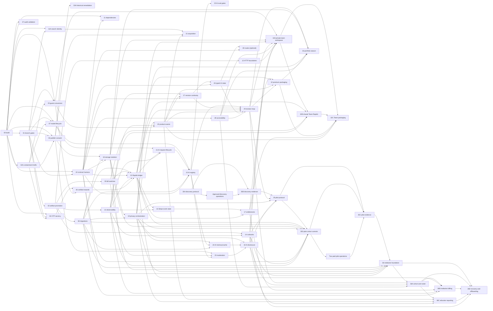

# Branch Delivery Portfolio

Each of the 52 directories below represents one proposed Git branch and contains a complete branch-level delivery
contract. These branches do not exist yet. The plans are ordered by dependency and risk, not by feature excitement.

## Base-branch rule

The initial checkout falsely appeared to lack `dev-main` because its fetch refspec exposed only `main`. Direct remote
verification found `dev-main` at `8869af1`: its tree matched audited `main`, while its history had diverged. Reconcile
through reviewed normal history—never force-reset—then branch standard work from protected, green `dev-main`. An
explicitly approved production hotfix may branch from `main` only when its release boundary requires it.

Do not create all branches at once. Create a branch when its dependencies and phase exit gate are satisfied.

## Portfolio

| # | Proposed branch | P | Phase | Mode | Plan |
|---:|---|---:|---:|---|---|
| 00 | `fix/release-build-blockers` | P0 | 0 | Critical path | [Plan](./00-fix-release-build-blockers/README.md) |
| 02A | `fix/p0-capability-containment` | P0 | 0 | Containment | [Plan](./02a-fix-p0-capability-containment/README.md) |
| 35A | `docs/education-market-discovery` | P2 | 0 | Parallel discovery | [Plan](./35a-docs-education-market-discovery/README.md) |
| 35B | `docs/education-discovery-evidence` | P2 | 0 | Evidence gate | [Plan](./35b-docs-education-discovery-evidence/README.md) |
| 01 | `fix/repository-release-gates` | P0 | 0 | Critical path | [Plan](./01-fix-repository-release-gates/README.md) |
| 37 | `chore/enterprise-audit-validation` | P1 | 0 | Documentation integrity | [Plan](./37-chore-enterprise-audit-validation/README.md) |
| 02 | `fix/staging-artifact-promotion` | P0 | 0 | Critical path | [Plan](./02-fix-staging-artifact-promotion/README.md) |
| 03 | `fix/explicit-gallery-consent` | P0 | 1 | Critical path | [Plan](./03-fix-explicit-gallery-consent/README.md) |
| 03A | `fix/historical-gallery-remediation` | P0 | 1 | Decision-gated closure | [Plan](./03a-fix-historical-gallery-remediation/README.md) |
| 04 | `fix/security-edu-otp-secrecy` | P0 | 1 | Critical path | [Plan](./04-fix-security-edu-otp-secrecy/README.md) |
| 05 | `fix/guest-account-conversion` | P0 | 1 | Critical path | [Plan](./05-fix-guest-account-conversion/README.md) |
| 06 | `fix/security-verified-identity-rewards` | P0 | 1 | Critical path | [Plan](./06-fix-security-verified-identity-rewards/README.md) |
| 07 | `fix/ai-model-lifecycle` | P0 | 1 | Critical path | [Plan](./07-fix-ai-model-lifecycle/README.md) |
| 31A | `fix/search-identity` | P1 | 1 | Parallel foundation | [Plan](./31a-fix-search-identity/README.md) |
| 08 | `refactor/versioned-appwrite-migrations` | P1 | 2 | Standard | [Plan](./08-refactor-versioned-appwrite-migrations/README.md) |
| 09 | `feat/server-enforced-kill-switches` | P1 | 2 | Standard | [Plan](./09-feat-server-enforced-kill-switches/README.md) |
| 10 | `chore/critical-contract-harness` | P1 | 2 | Standard | [Plan](./10-chore-critical-contract-harness/README.md) |
| 11 | `chore/security-runtime-dependencies` | P1 | 2 | Standard | [Plan](./11-chore-security-runtime-dependencies/README.md) |
| 12 | `fix/http-security-boundaries` | P1 | 2 | Standard | [Plan](./12-fix-http-security-boundaries/README.md) |
| 13 | `feat/operational-observability` | P1 | 2 | Standard | [Plan](./13-feat-operational-observability/README.md) |
| 14 | `docs/incident-dr-release-runbooks` | P1 | 2 | Standard | [Plan](./14-docs-incident-dr-release-runbooks/README.md) |
| 15 | `fix/atomic-rapido-ledger` | P0 | 3 | Critical path | [Plan](./15-fix-atomic-rapido-ledger/README.md) |
| 16 | `fix/stripe-webhook-idempotency` | P0 | 3 | Critical path | [Plan](./16-fix-stripe-webhook-idempotency/README.md) |
| 17 | `fix/stripe-entitlement-reconciliation` | P1 | 3 | Standard | [Plan](./17-fix-stripe-entitlement-reconciliation/README.md) |
| 18 | `fix/security-storage-tenant-isolation` | P0 | 3 | Critical path | [Plan](./18-fix-security-storage-tenant-isolation/README.md) |
| 19 | `fix/privacy-data-lifecycle` | P1 | 3 | Standard | [Plan](./19-fix-privacy-data-lifecycle/README.md) |
| 20 | `feat/product-funnel-instrumentation` | P1 | 4 | Standard | [Plan](./20-feat-product-funnel-instrumentation/README.md) |
| 21 | `fix/ai-request-lifecycle` | P1 | 4 | Standard | [Plan](./21-fix-ai-request-lifecycle/README.md) |
| 22 | `refactor/ai-operation-registry` | P1 | 4 | Standard | [Plan](./22-refactor-ai-operation-registry/README.md) |
| 23 | `chore/ai-evaluation-gates` | P1 | 4 | Standard | [Plan](./23-chore-ai-evaluation-gates/README.md) |
| 24 | `fix/ai-memory-cache-semantics` | P1 | 4 | Standard | [Plan](./24-fix-ai-memory-cache-semantics/README.md) |
| 25 | `fix/ai-moderation-boundaries` | P1 | 4 | Standard | [Plan](./25-fix-ai-moderation-boundaries/README.md) |
| 34 | `feat/ai-trust-disclosure` | P1 | 4 | Standard | [Plan](./34-feat-ai-trust-disclosure/README.md) |
| 26 | `refactor/typed-analysis-state-machine` | P2 | 5 | Standard | [Plan](./26-refactor-typed-analysis-state-machine/README.md) |
| 27 | `fix/revision-continuity` | P1 | 5 | Standard | [Plan](./27-fix-revision-continuity/README.md) |
| 28 | `fix/core-flow-accessibility` | P1 | 5 | Standard | [Plan](./28-fix-core-flow-accessibility/README.md) |
| 29 | `feat/revision-learning-loop` | P1 | 5 | Standard | [Plan](./29-feat-revision-learning-loop/README.md) |
| 30 | `refactor/app-router-boundaries` | P2 | 5 | Optional | [Plan](./30-refactor-app-router-boundaries/README.md) |
| 31 | `fix/acquisition-foundation` | P1 | 6 | Standard | [Plan](./31-fix-acquisition-foundation/README.md) |
| 32 | `feat/premium-packaging` | P2 | 6 | Standard | [Plan](./32-feat-premium-packaging/README.md) |
| 32A | `feat/private-team-workspace` | P2 | 6 | Optional team track | [Plan](./32a-feat-private-team-workspace/README.md) |
| 32B | `feat/shared-team-rapido-pool` | P1 | 6 | Optional financial gate | [Plan](./32b-feat-shared-team-rapido-pool/README.md) |
| 32C | `feat/team-packaging` | P2 | 6 | Optional team track | [Plan](./32c-feat-team-packaging/README.md) |
| 33 | `feat/portfolio-season` | P2 | 6 | Standard | [Plan](./33-feat-portfolio-season/README.md) |
| 35 | `docs/education-studio-pilot` | P2 | 7 | Evidence-gated | [Plan](./35-docs-education-studio-pilot/README.md) |
| 35D | `feat/education-pilot-cohort-controls` | P1 | 7 | Enrollment/financial gate | [Plan](./35d-feat-education-pilot-cohort-controls/README.md) |
| 35C | `docs/education-pilot-evidence` | P2 | 7 | Evidence gate | [Plan](./35c-docs-education-pilot-evidence/README.md) |
| 36 | `feat/institution-foundation` | P3 | 8 | Evidence-gated | [Plan](./36-feat-institution-foundation/README.md) |
| 36A | `feat/institution-cohort-roster` | P3 | 8 | Evidence-gated | [Plan](./36a-feat-institution-cohort-roster/README.md) |
| 36B | `feat/institution-billing-rapido` | P2 | 8 | Financial gate | [Plan](./36b-feat-institution-billing-rapido/README.md) |
| 36C | `feat/institution-educator-reporting` | P3 | 8 | Evidence-gated | [Plan](./36c-feat-institution-educator-reporting/README.md) |
| 36D | `feat/institution-recovery-offboarding` | P2 | 8 | General-availability gate | [Plan](./36d-feat-institution-recovery-offboarding/README.md) |

## Critical dependency graph

The `Depends on` field in each branch plan is normative. This diagram includes every branch-to-branch hard dependency;
decision IDs and owner approvals remain in branch metadata. Automated validation must reject a missing target or cycle.

## Global branch rules

- A branch with an unassigned DRI/approver or unset target must not start.
- One branch owns one rollback boundary. No hidden cleanup or unrelated refactor.
- All schema, wallet, storage, historical-publication, and irreversible deletion actions require explicit owner approval.
- Rollbacks are new commits/PRs; never erase history with force-push or reset.
- A security rollback cannot restore plaintext OTP, automatic publication, retired AI models, or client-owned authority.
- Every PR links production-path tests, rollout evidence, metrics, and rollback instructions.
- The phase exit gate wins over calendar dates.
