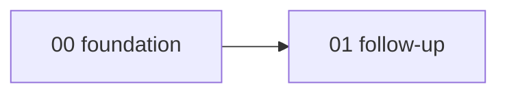

# Branch Delivery Portfolio

Each directory below represents one delivery branch and contains a complete branch-level contract.

## Portfolio

| # | Proposed branch | P | Phase | Mode | Plan |
|---:|---|---:|---:|---|---|
| 00 | `fix/foundation` | P1 | 0 | Critical path | [Plan](./00-foundation/README.md) |
| 01 | `feat/follow-up` | P2 | 1 | Standard | [Plan](./01-follow-up/README.md) |

## Critical dependency graph

